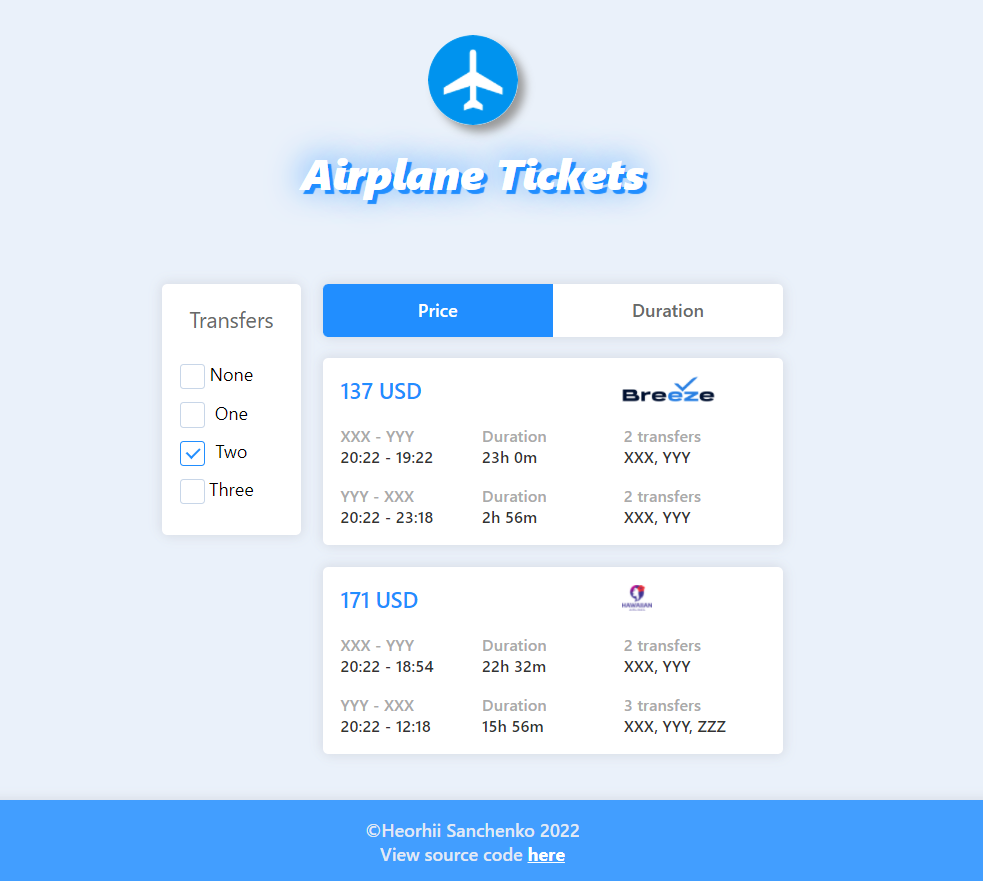
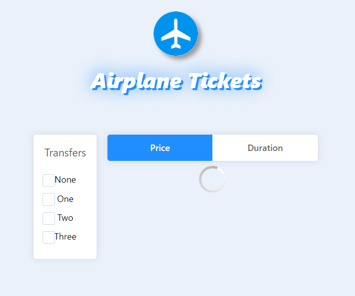

#Airplane Tickets

This is my pet project for sorting and filtering airplane tickets

## Scripts

To start the app locally, both in the server and the client directory run:

### `npm start`

The app will run on [http://localhost:3000](http://localhost:3000).

I also deployed this app on Heroku:

Client: [[https://sanchez-airplane-tickets.herokuapp.com]([https://sanchez-airplane-tickets.herokuapp.com)

Server: [https://sanchez-airplane-server.herokuapp.com](https://sanchez-airplane-server.herokuapp.com)

The server responds with random mock data.

The client includes a list of available tickets and controls to sort the list
by price/duration or filter by the amount of transfers.

Also, while loading data from server, the client shows a custom spinner.

